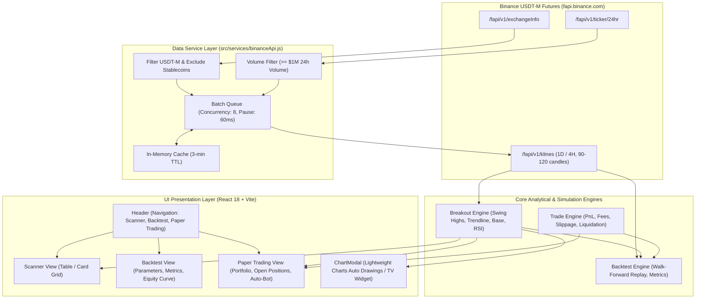

# BREAQ — Binance USDT-M Futures Breakout Scanner, Backtesting & Paper Trading Terminal

> Real-time algorithmic breakout scanner, institutional backtesting engine, live paper trading simulator, and automated technical drawing terminal for Binance USDT-M Perpetual Futures.

---

## Overview

In cryptocurrency derivative markets, the most profitable expansion moves frequently occur when an asset breaks out of a prolonged descending trendline or base consolidation after an extended accumulation phase (e.g., PHA, ARB, LDO). Identifying these setups manually across hundreds of liquid perpetual contracts in real time is error-prone and labor-intensive.

**BREAQ** is a high-performance, client-side web application designed to scan 250+ liquid Binance USDT-M perpetual contracts simultaneously. It evaluates multi-period candlestick structures (1D and 4H), calculates mathematical trendlines using swing high regression, monitors volume expansion relative to 20-period moving averages, and categorizes pairs into actionable lifecycle stages: **Coiling (Pre-Breakout)**, **Fresh Breakout**, and **Extended (Overbought)**.

In addition to market scanning, BREAQ features an institutional-grade **Backtesting Engine** (with realistic fees, slippage, and zero look-ahead bias), a **Paper Trading Simulator** with automated signal execution bots, and **Automated Chart Drawings** powered by TradingView Lightweight Charts v5.

---

## Key Features

- **Automated USDT-M Futures Scanning**: Dynamically queries the Binance Futures Exchange Info endpoint (`/fapi/v1/exchangeInfo`) and 24-hour ticker statistics (`/fapi/v1/ticker/24hr`), filtering out spot pairs, stablecoin collateral contracts (`USDCUSDT`, `BUSDUSDT`, `FDUSDUSDT`, `TUSDUSDT`), and index tokens (`BTCDOMUSDT`).
- **3-Stage Breakout Classification**:
  - **Coiling / Pre-Breakout (`COILING`)**: Consolidating within -4.0% to 0.0% of key resistance with 7-period performance under +18%. Early accumulation phase before expansion.
  - **Fresh Breakout (`FRESH_BREAKOUT`)**: Clean break of resistance (0% to +15%) occurring within the last 1–3 candles, validated by a volume surge of $\ge 1.5\times$ the 20-period volume SMA.
  - **Extended / High Risk (`EXTENDED`)**: Price has surged $> 20\%$, 7-period gain $> 35\%$, or RSI(14) $> 75$. High probability of mean-reversion or pullback.
- **Dual Timeframe Analysis**:
  - **1D (Daily)**: Macro descending trendline and structural base breakouts.
  - **4H (4-Hour)**: Intraday momentum breakouts and aggressive swing setups.
- **Automated Chart Drawings (Lightweight Charts v5)**:
  - Official TradingView open-source library (`lightweight-charts` v5.2.1) integration with full 60fps canvas performance.
  - **Auto Trendlines**: Connects identified swing high peaks ($p_1, p_2$) and projects trendline slope dynamically.
  - **Resistance & Breakout Price Lines**: Automatic cyan price line with price tags.
  - **Stop-Loss & Take-Profit (1.5R) Lines**: Dynamic swing-low based risk/reward targets.
  - **Signal Markers**: Automatic `🚀 FRESH BREAKOUT` or `⏳ COILING` markers directly on candles.
  - **Hybrid Toggle**: Switch between **🤖 Auto Drawings (Lightweight Charts)** and **🌐 TradingView (Classic Widget)** with a single click.
- **Historical Backtesting Engine**:
  - Walk-forward chronological candle replay with **zero look-ahead bias**.
  - Realistic taker fee modeling (0.05%) and dynamic slippage (0.05% - 0.15%).
  - Detailed metrics: Win Rate, Profit Factor, Net PnL, Maximum Drawdown (MDD), Sharpe Ratio, and interactive SVG equity curve.
- **Live Paper Trading Simulator**:
  - Virtual $10,000 USDT margin wallet with isolated margin and adjustable leverage (1x to 20x).
  - One-click order execution with TP/SL risk calculators.
  - **Automated Trading Bot**: Auto-opens simulated positions when fresh breakouts with volume surges are detected.
  - Persistent state in browser `localStorage`.
- **Resilient API Architecture**:
  - Concurrency-controlled batched requests (8 parallel connections).
  - Exponential backoff retry handling for HTTP 429 rate limits.
  - Binance API rate-limit weight tracking (`x-mbx-used-weight-1m`).
  - In-memory caching with a 3-minute TTL to minimize bandwidth and request overhead.
  - Automatic background rescan cycle every 4 minutes with live progress telemetry.
- **Dual View Modes**: Switch seamlessly between a sortable data table (`CoinTable`) and a responsive card grid (`CoinCard`).

---

## How It Works & Architecture

BREAQ operates entirely in the browser as a zero-backend Single Page Application (SPA), directly querying Binance's public REST endpoints without requiring API keys or secret credentials.



---

## Technical Analysis & Mathematical Specifications

### 1. Descending Trendline Calculation
- Evaluates the most recent $N=90$ candles for the selected timeframe.
- Identifies local swing high peaks using a 2-period sliding window:
  $$\text{Peak}_i \iff \text{High}_i > \max(\text{High}_{i-2}, \text{High}_{i-1}) \quad \text{and} \quad \text{High}_i \ge \max(\text{High}_{i+1}, \text{High}_{i+2})$$
- Formulates candidate linear trendlines between lower highs:
  $$\text{Slope } m = \frac{\text{High}_{p2} - \text{High}_{p1}}{p2 - p1} \quad (m < 0, \; p2 > p1)$$
- **Historical Validation**: Ensures intermediate candles prior to the breakout window (last 3 candles) do not pierce above the trendline by more than a 2.5% tolerance buffer.
- Projects current resistance at the latest candle index $L$:
  $$R_{\text{trend}} = m \times L + \text{Intercept}$$

### 2. Horizontal Base Consolidation Resistance
- Examines past 30 candles excluding the latest 3 candles:
  $$R_{\text{base}} = \max(\text{Close}_{L-30 \dots L-3})$$
- Active breakout level prioritizes descending trendline resistance $R_{\text{trend}}$ when valid; otherwise falls back to horizontal base resistance $R_{\text{base}}$.

### 3. Wilder's Smoothed RSI (14 Periods)
Calculates smoothed relative strength index according to J. Welles Wilder Jr.'s formula:
$$\text{RS} = \frac{\text{Smoothed Avg Gain}}{\text{Smoothed Avg Loss}}, \quad \text{RSI} = 100 - \left(\frac{100}{1 + \text{RS}}\right)$$
*Zero volatility edge-case handling returns neutral 50.*

### 4. Breakout Distance & Classification Logic
$$\Delta \% = \left(\frac{\text{Price} - R}{R}\right) \times 100$$

| Status | Code Symbol | Condition Criteria | Trading Interpretation |
| :--- | :--- | :--- | :--- |
| **Coiling** | `COILING` | $-4.0\% \le \Delta\% \le 0.0\%$ AND 7-period return $< 18\%$ | Coiling right below resistance; primed for breakout without prior pump. |
| **Fresh Breakout** | `FRESH_BREAKOUT` | $0.0\% < \Delta\% \le +15.0\%$ AND breakout in last 1–3 candles AND Volume Ratio $\ge 1.5\times$ | High-probability trend transition; momentum expansion confirmed. |
| **Extended** | `EXTENDED` | $\Delta\% > +20\%$ OR 7-period return $> +35\%$ OR RSI $> 75$ | Extended move; high risk of pullback or consolidation. |
| **Neutral / None** | `NONE` | Fails above criteria | In active downtrend or not near critical inflection level. |

---

## Project Structure

```
BREAQ/
├── .github/
│   └── workflows/
│       └── ci.yml                        # GitHub Actions CI workflow (test & build)
├── src/
│   ├── components/                       # UI components (React)
│   │   ├── BacktestView.jsx              # Backtesting dashboard & equity curve
│   │   ├── ChartModal.jsx                # Chart modal with mode switcher
│   │   ├── CoinCard.jsx                  # Card/Grid view component
│   │   ├── CoinTable.jsx                 # Sortable tabular data view
│   │   ├── Header.jsx                    # Top navbar, search, navigation, scan trigger
│   │   ├── InteractiveChart.jsx          # Lightweight Charts v5 with automated drawings
│   │   ├── PaperTradeModal.jsx           # Manual paper order execution modal
│   │   ├── PaperTradingView.jsx          # Live paper trading terminal & auto-bot
│   │   ├── StatsBar.jsx                  # Category counter metrics and scanning progress bar
│   │   ├── StatusBadge.jsx               # Visual status badges (Coiling, Fresh, Extended, Neutral)
│   │   └── Tabs.jsx                      # Filter tab navigation and view mode switcher
│   ├── hooks/
│   │   ├── usePaperTrading.js            # Paper trading state & wallet manager
│   │   └── useScanner.js                 # Core orchestrator hook (fetching, state, polling)
│   ├── services/
│   │   ├── backtestEngine.js             # Historical simulation with zero look-ahead bias
│   │   ├── binanceApi.js                 # Binance USDT-M Futures client with rate-limiting & cache
│   │   ├── breakoutEngine.js             # Technical indicators, trendline regression, status engine
│   │   └── tradeEngine.js                # Core trade execution, PnL, fees, and liquidation math
│   ├── App.jsx                           # Root application component & view routing
│   ├── index.css                         # Dark trading terminal design system & CSS variables
│   └── main.jsx                          # React DOM entry point
├── tests/
│   ├── backtestEngine.test.js            # Backtest engine verification & zero look-ahead tests
│   ├── binanceApi.test.js                # API client integration tests & caching verification
│   ├── breakoutEngine.test.js            # Indicator math, trendline, and classification unit tests
│   └── tradeEngine.test.js               # Fee, slippage, liquidation, and PnL unit tests
├── .gitignore                            # Git ignore rules for Node, Vite, logs, and OS files
├── CONTRIBUTING.md                       # Contribution guidelines
├── index.html                            # HTML entry point with Google Fonts preconnect
├── LICENSE                               # MIT License
├── package.json                          # Project manifest and scripts
├── SECURITY.md                           # Security policy and vulnerability disclosure
├── vite.config.js                        # Vite build configuration (port 5173, host enabled)
└── README.md                             # Comprehensive project documentation
```

---

## Installation & Quick Start

1. **Clone the repository:**
   ```bash
   git clone https://github.com/senoldak/BREAQ.git
   cd BREAQ
   ```

2. **Install dependencies:**
   ```bash
   npm install
   ```

3. **Start the local development server:**
   ```bash
   npm run dev
   ```

4. **Open your browser:**
   ```
   http://localhost:5173
   ```

---

## Testing & Quality Assurance

BREAQ includes automated unit and integration tests powered by Node.js's native test runner (`node:test`).

```bash
npm test
```

### Verified Test Scenarios (17 Passing Tests)
1. **Zero Look-Ahead Bias**: Backtest candle replay strictly isolates past historical candles from future price action.
2. **Backtest Metrics**: Accurate calculation of Win Rate, Maximum Drawdown (MDD), and Sharpe Ratio.
3. **Trade Math**: Verification of taker fee calculations, dynamic slippage impact, and liquidation thresholds.
4. **Trade Execution**: Exit condition evaluation (SL low penetration, TP1 partial exit, Breakeven SL move).
5. **Binance Futures API**: Validation of USDT-M contract filtering, rate-limit backoff, and in-memory kline caching.
6. **Breakout Pattern Recognition**: Detection of descending trendlines (e.g. PHA), pre-breakout coiling, and volume-surge filters.

---

## License

This project is licensed under the MIT License — see the [LICENSE](LICENSE) file for details.

---

## Disclaimer

*This software is for informational and educational purposes only. Cryptocurrency derivatives and futures trading involve substantial risk of loss and are not suitable for every investor. The breakout signals generated by this software do not constitute financial, investment, or trading advice. Always conduct your own research and manage risk responsibly.*
